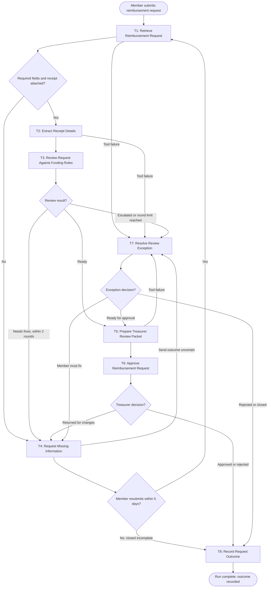

# Workflow of Tasks

## 1. Workflow Goal

This workflow supports the goal in our completed [team charter](https://github.com/ChrisLim7/BUS4498_Team_Build/blob/main/README.md).

## 2. Workflow Trigger

A Cal Poly club member submits a reimbursement request, or a corrected resubmission, through the club's PayBack request form. The form collects the amount, purchase date, purchase description, event, expense category, optional pre-approval reference, and receipt file. It does not collect bank or payment details.

## 3. Completion Condition at Runtime

A run is complete when the request has a final outcome recorded in T8: approved by the treasurer, rejected, or closed as incomplete because the member did not respond within 5 days. The record must show whether the treasurer returned the request and how many fix rounds it took. A request waiting on the member or the treasurer is paused, not complete.

## 4. General Workflow

When a request arrives, PayBack retrieves the form, the receipt, the club's funding rules, and the club's past requests (T1: Retrieve Reimbursement Request). If required fields or the receipt are missing, the member is asked for them right away (T4: Request Missing Information). Otherwise, PayBack reads the receipt (T2: Extract Receipt Details) and reviews the request against the funding rules (T3: Review Request Against Funding Rules). T3 matches the receipt to the form, classifies the expense, checks each applicable rule, and checks for duplicate submissions, choosing what to check next based on what it finds.

T3 ends with one of three results:

- **Ready:** PayBack prepares a review packet for the treasurer (T5: Prepare Treasurer Review Packet), and the treasurer approves, returns, or rejects the request (T6: Approve Reimbursement Request).
- **Needs fixes:** T4 sends the member one message listing the exact fixes. A resubmission within 5 days restarts the run at T1. No response closes the request as incomplete. Members get at most 2 fix rounds.
- **Escalated:** the treasurer reviews the case (T7: Resolve Review Exception). This covers possible duplicates, unclear or unfamiliar rules, prohibited items, and fixes still needed after 2 rounds.

A tool failure in T1, T2, T5, or T8, or an uncertain message send in T4, also goes to T7, and the run never continues as if that step succeeded. After reviewing, the treasurer can send the request to T5, back to the member through T4, or close it.

Every final outcome is recorded (T8: Record Request Outcome). This lets the club measure the share of requests the treasurer returns at least once against the charter's target of 10% or less. Approved payments are processed through the club's existing payment process outside PayBack.

## 5. Workflow Diagram

